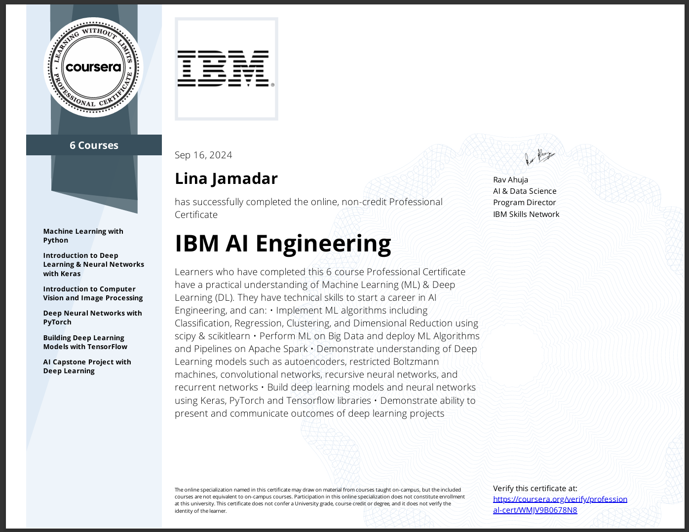

# IBM AI Engineering Professional Certificate:
## AI Capstone Project Deep Learning PyTorch
Learning Objectives:
- 1: In this module, you will get introduced to the problem that we will try to solve throughout the course. You will also learn how to load the image dataset, manipulate images, and visualize them.
- 2:In this Module, you will mainly learn how to process image data and prepare it to build a classifier using pre-trained models. 
- 3:In this Module, in the PyTorch part, you will learn how to build a linear classifier. 
- 4:In this Module, in the PyTorch part, you will complete a peer review assessment where you will be asked to build an image classifier using the ResNet18 pre-trained model.

[View Certificate](https://www.coursera.org/account/accomplishments/specialization/certificate/WMJV9B0678N8)
